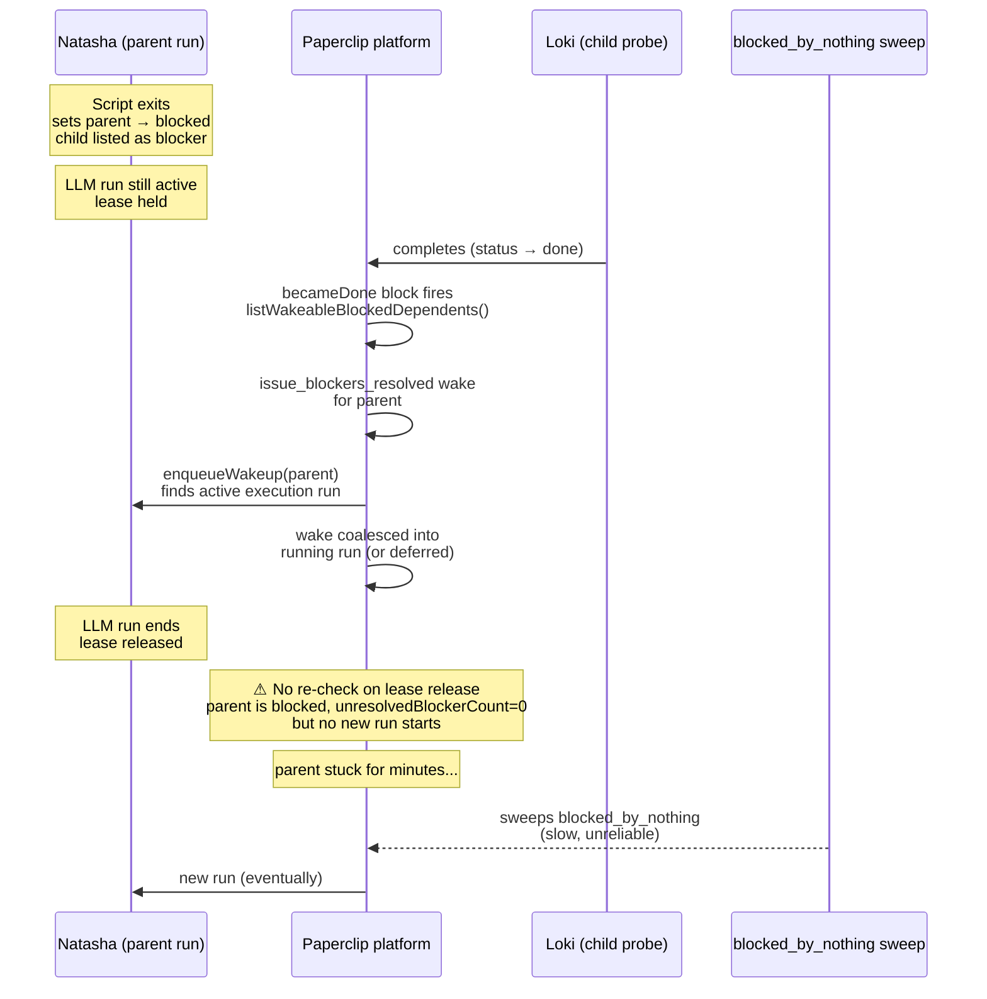
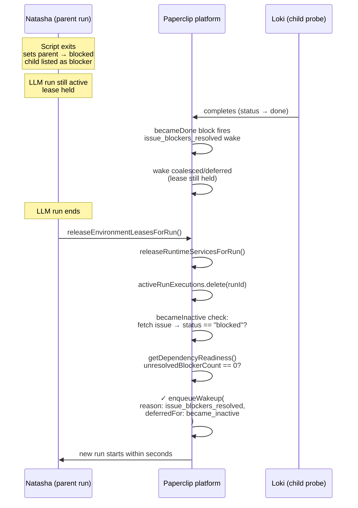

# SPEC became-inactive-wake-fix

**Date:** 2026-05-31  
**Branch:** `feat-becameInactive-event` → cherry-picked to `main`  
**Fix commit:** `e0e4e0c5c` (fix) + `20322bc07` (tests)  
**Observed instances:** LINAA-884, LINAA-874, LINAA-860, LINAA-856

---

## Symptom

A parent issue becomes `blocked` mid-run (agent creates a child probe and sets
itself blocked on it). The child completes quickly. The parent sits `blocked`
with `unresolvedBlockerCount: 0` for minutes or indefinitely — no new run
starts until the slow-path `blocked_by_nothing` liveness sweep catches it
(potentially minutes later, and not reliably in all environments).

Confirmed in LINAA-884:
- Child (LINAA-885, Loki) completed at **10:17:36**
- Parent's (LINAA-884, Natasha) lease released at **10:18:54** — 78 s later
- No second run ever started for LINAA-884

---

## Root cause

Paperclip's run lifecycle has a **lease** concept: a heartbeat run holds an
environment lease for the duration of the LLM turn. Two separate events happen
at different times:

1. **Script exits** — the agent's script returns, setting the issue to
   `blocked` and listing the child as the blocker.
2. **LLM run ends** — the full adapter.execute() call returns (may be up to
   ~90 s after the script exits). This is when the lease is released and a new
   run can start.

When `issue_blockers_resolved` fires (step A below), the platform checks
whether the parent is ready to run. It is in `blocked` state so the wake is
correctly targeted. But the parent's run still holds the **execution lease**,
so `enqueueWakeup` detects an active execution path and defers/coalesces the
new wake into the running run rather than queuing a second one.

When the running run finally ends (step B), no re-check occurs. The deferred
wake was already consumed / merged into the context of the just-finished run,
and is not re-fired. The parent sits stuck.

The `blocked_by_nothing` recovery in
`server/src/services/recovery/issue-graph-liveness.ts` is a timer-driven sweep
that eventually detects this state, but it is a slow path and not a reliable
fix for production throughput.

---

## Race diagram

### Before fix — parent gets stuck



### After fix — becameInactive check



---

## Fix

**File:** `server/src/services/heartbeat.ts`  
**Function:** `executeRun` (inner function, ~L7016)  
**Location:** `finally` block, after lease and runtime services are released

```typescript
// becameInactive: if the run's issue is now blocked with all blockers
// resolved, the issue_blockers_resolved wake may have fired while this
// run still held its lease and been lost. Re-fire here so the issue
// doesn't sit stuck indefinitely.
try {
  const becameInactiveIssueId = readNonEmptyString(parseObject(run.contextSnapshot).issueId);
  if (becameInactiveIssueId) {
    const becameInactiveIssue = await db
      .select({ id: issues.id, status: issues.status, assigneeAgentId: issues.assigneeAgentId })
      .from(issues)
      .where(and(eq(issues.id, becameInactiveIssueId), eq(issues.companyId, run.companyId)))
      .then((rows) => rows[0] ?? null);
    if (becameInactiveIssue?.status === "blocked" && becameInactiveIssue.assigneeAgentId) {
      const readiness = await issuesSvc.getDependencyReadiness(becameInactiveIssueId);
      if (readiness.unresolvedBlockerCount === 0) {
        await enqueueWakeup(becameInactiveIssue.assigneeAgentId, {
          source: "automation",
          triggerDetail: "system",
          reason: "issue_blockers_resolved",
          payload: { issueId: becameInactiveIssue.id, blockerIssueIds: readiness.blockerIssueIds, deferredFor: "became_inactive" },
          contextSnapshot: { issueId: becameInactiveIssue.id, taskId: becameInactiveIssue.id,
            wakeReason: "issue_blockers_resolved", source: "run.became_inactive",
            blockerIssueIds: readiness.blockerIssueIds },
        });
      }
    }
  }
} catch (err) {
  logger.warn({ err, runId: run.id }, "becameInactive wake check failed");
}
```

### Why in the `finally` block

The `finally` block is the only point that runs unconditionally regardless of
whether the run succeeded, failed, or was killed. This ensures:

- Successful runs are covered (agent set blocked + resolved + ran to completion)
- Failed runs are covered (agent may have crashed after setting up the state)
- Setup-failure runs are covered (outer catch path also lands here)

### Why after `activeRunExecutions.delete`

`activeRunExecutions` is the in-process set of running run IDs. Clearing it
before calling `enqueueWakeup` ensures the new run can be picked up immediately
by `startNextQueuedRunForAgent` in the same finally sequence.

### Deduplication (requirement 4)

`enqueueWakeup` already provides idempotent deduplication:

| Situation | `enqueueWakeup` behaviour |
|-----------|--------------------------|
| Another run already queued for the issue (same agent) | Coalesces: merges context into existing queued run, no second run created |
| A run by a different agent is active | Creates `deferred_issue_execution` wake; promoted when that run ends |
| A `deferred_issue_execution` already exists | Merges context into existing deferred row |
| `isDependencyReady == false` | Skipped with reason `issue_dependencies_blocked` |

The pre-guard (`status == "blocked" && unresolvedBlockerCount == 0`) prevents
the `enqueueWakeup` call entirely when conditions aren't met, keeping the hot
path (every run ending) cheap.

---

## Existing `blocked_by_nothing` recovery

`server/src/services/recovery/issue-graph-liveness.ts` has a timer-driven
sweep that detects `status == "blocked" && unresolvedBlockerCount == 0` and
fires a recovery wake. This fix does **not** replace it — the sweep remains as
a backstop for cases the event-driven check might miss (e.g., a run that ends
with no `contextSnapshot.issueId`, or a state transition that happens outside
the run lifecycle).

---

## Tests

**File:** `server/src/__tests__/heartbeat-became-inactive.test.ts`  
Uses embedded PostgreSQL + mocked adapter (same pattern as
`heartbeat-dependency-scheduling.test.ts`).

| Test | Scenario | Assertion |
|------|----------|-----------|
| Positive | Parent run active; child resolves mid-run; parent set to blocked mid-run; run ends | `agentWakeupRequests` row with `reason=issue_blockers_resolved`, `deferredFor=became_inactive`; second run enqueued |
| Negative — not blocked | Run completes, issue stays `todo` | No `became_inactive` wakeup request created |
| Negative — unresolved blockers | Two blockers added mid-run; one resolves, one doesn't; run ends | No `became_inactive` wakeup request created |

**Note on the positive test:** The mock adapter never transitions the parent
out of `blocked`, which would create an infinite re-wake cascade (each run ends
→ becameInactive check fires → new run → …). After asserting the second wake
is enqueued, the test sets the parent issue to `done` to drain the cascade
before cleanup.

---

## Sequence position in `executeRun` finally block

```
finally {
  ① latestRun = await getRun(run.id)
  ② await releaseEnvironmentLeasesForRun(...)   ← workspace leases dropped
  ③ await releaseRuntimeServicesForRun(...)      ← runtime services dropped
  ④ activeRunExecutions.delete(run.id)           ← run removed from active set
  ⑤ [NEW] becameInactive check                  ← re-wake if stuck
  ⑥ await startNextQueuedRunForAgent(run.agentId)
}
```

Step ⑤ runs after the lease is fully released (②) and the run is no longer
tracked as active (④), so any new run created by `enqueueWakeup` can be
immediately claimed by step ⑥.

---

## Related

- `server/src/routes/issues.ts` — `becameDone` block (~L4805): the symmetric
  event-driven wake that fires when a blocker transitions to `done`. This fix
  handles the case where that wake arrived while the dependent's run was active.
- `server/src/services/heartbeat.ts` — `workspace_finalize` re-fire block
  (~L8334): analogous pattern — fires dependent wakes after a run's workspace
  sync completes. `becameInactive` follows the same design.
- `server/src/services/recovery/issue-graph-liveness.ts` — `blocked_by_nothing`
  slow-path backstop; left unchanged.
